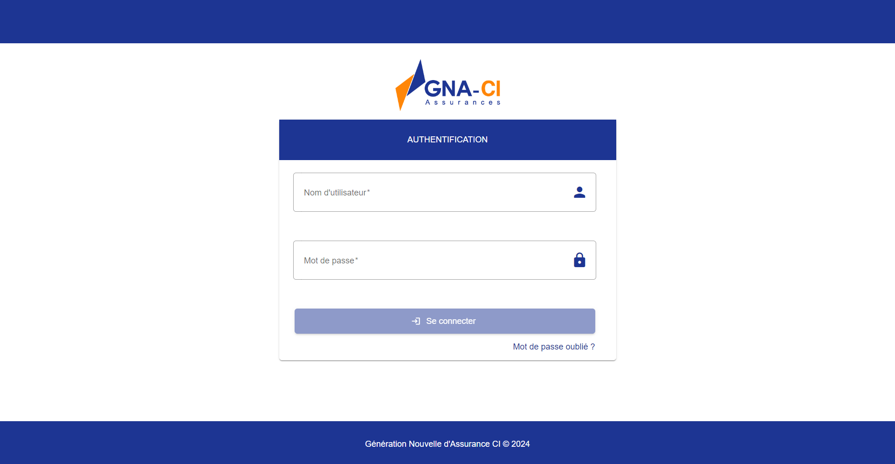

# GNA Web Application - Back-Office

## Table des Matières
- Introduction
- Fonctionnalités
- Prérequis
- Installation
- Configuration
- Utilisation
- Tests
- Déploiement
- Contribuer
- Licence
- Auteurs

### Introduction
Ce projet est une application web Angular qui permet de N/A. Il a été conçu pour N/A.

### Prérequis
Avant de commencer, assurez-vous que les éléments suivants sont installés dans votre environnement :

- Node v20.10.0 ou plus
- Angular v17.0.7 ou plus
- Git

### Configuration
Voir le fichier d'environnement `src/environnement/environnement.ts` :

##### changer les paramètres d'environnement
    - apiGateway: (URL de votre environnement + le port du service api-gateway),
    - usersService: (URL de votre environnement + le port du service api-gateway)/users-service,
    - usersExternalService: (URL de votre environnement + le port du service api-gateway)/users-external-service,
    - productsService: (URL de votre environnement + le port du service api-gateway)/products-service,
    - customersService: (URL de votre environnement):28090"
